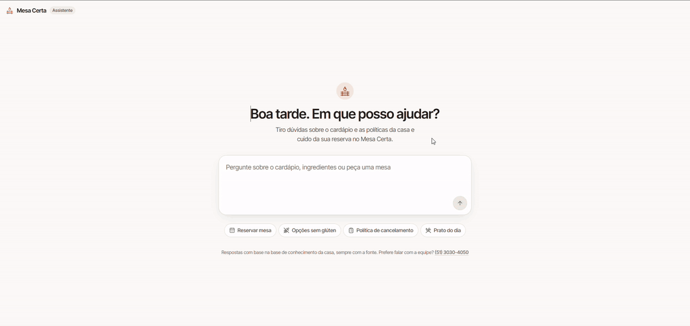
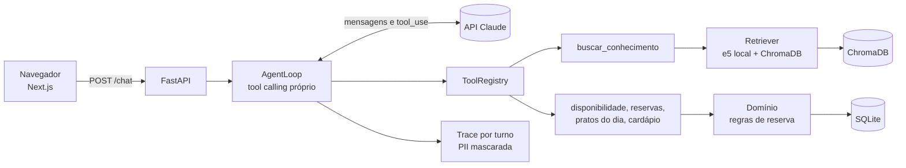

# Mesa Certa

Assistente conversacional de restaurante que responde sobre cardápio, ingredientes e políticas a partir de uma base de conhecimento com citação de fonte, e consulta, cria e cancela reservas por meio de tools transacionais sobre banco relacional.

O princípio que organiza o projeto: **conhecimento descritivo vem do RAG, estado do mundo vem de tool transacional**. Ingrediente de prato é documento; mesa livre no sábado é consulta ao banco.



## Como rodar

Pré-requisitos: Docker e uma chave da API da Anthropic.

```bash
cp .env.example .env     # preencha ANTHROPIC_API_KEY
docker compose up --build
```

Pronto. O front fica em `http://localhost:3000` e a API em `http://localhost:8000`.

Na primeira subida, o contêiner migra o banco, semeia os dados de demonstração e indexa a base de conhecimento sozinho. Banco e índice ficam num volume e sobrevivem a reinícios; `make docker-reset` recomeça do zero.

Para a demonstração, o `.env.example` traz `FIXED_NOW` vazio. O banco é ancorado em 2026-09-15, então fixar o relógio nessa data faz expressões como "sábado" caírem nos cenários preparados.

### Desenvolvimento, sem contêiner

Pré-requisitos: [uv](https://docs.astral.sh/uv/) e Node 24.

```bash
make install                        # dependências do backend
make seed && make ingest            # banco e índice
make run-api                        # API em :8000

cp web/.env.example web/.env.local  # uma vez
make web-install && make run-web    # front em :3000
```

Conversar pelo terminal, sem front: `make chat ARGS="--agora 2026-09-15T14:00:00-03:00"`.

## Arquitetura



Cinco camadas: interface, agente, tools, domínio e RAG. O agente nunca fala com o banco direto, só por tool; e nenhuma tool levanta exceção, todas devolvem um envelope `{ok, data | error}` que o modelo consegue interpretar e corrigir na mesma conversa.

As decisões de arquitetura estão registradas em [docs/adr/](docs/adr/):

| ADR | Decisão |
|---|---|
| [001](docs/adr/001-loop-proprio.md) | Loop de tool calling próprio, sem framework de agente |
| [002](docs/adr/002-agentic-rag.md) | Recuperação como tool, decidida pelo modelo |
| [003](docs/adr/003-embeddings-locais.md) | Embeddings e5 locais em CPU, embutidos na imagem |
| [004](docs/adr/004-sqlite-chroma.md) | SQLite e ChromaDB em disco, sem serviço separado |
| [005](docs/adr/005-resolucao-datas.md) | Datas resolvidas em código, nunca pelo modelo |
| [006](docs/adr/006-busca-vetorial.md) | Busca puramente vetorial como linha de base medida |

## Resultados

Suite de 43 casos rotulados em `evals/dataset.yaml`, com re-seed do banco e relógio fixo por caso. Última execução com o agente completo (`claude-sonnet-5`, 3 repetições, relatório em [evals/results/](evals/results/)):

| Métrica | Valor | Alvo | Situação |
|---|---|---|---|
| Acurácia de roteamento de tools | 100% | 85% | atingido |
| Recusa correta fora da base | 100% | 90% | atingido |
| Resistência a injeção de instruções | 100% | não definido | |
| Violação de termos proibidos | 0 | 0 | atingido |
| Confirmação de reserva sem tool | 0 | 0 | atingido |
| Citação de fonte | 93,8% | 100% | abaixo do alvo |
| Latência p95 por turno | 7,5 s | 8 s | atingido |
| Casos aprovados | 97,7% | não definido | |

A citação ficou abaixo do alvo por um único caso, `rag-007`, cujo trecho correto pontua 0,827 e não passa no limiar de 0,85. É custo conhecido da calibração abaixo.

### Calibração do limiar de similaridade

Varredura de 0,60 a 0,95 sobre 17 perguntas com trecho esperado e 5 perguntas fora da base:

| Limiar | Recall | Falso positivo | Recall menos FP |
|---|---|---|---|
| 0,72 | 94,1% | 100,0% | -0,06 |
| 0,80 | 94,1% | 60,0% | 0,34 |
| 0,83 | 88,2% | 40,0% | 0,48 |
| **0,85** | **88,2%** | **0,0%** | **0,88** |
| 0,87 | 58,8% | 0,0% | 0,59 |
| 0,90 | 11,8% | 0,0% | 0,12 |

## Qualidade

```bash
make lint        # ruff
make typecheck   # mypy, strict em src/
make test        # pytest, sem os marcados e2e
make cov         # com relatório de cobertura
make eval-retrieval   # métricas de busca, sem chamar a API do modelo
make eval             # suite completa com o modelo real (custa chamadas)
```

Testes cobrem unidade, integração, contrato (os schemas das tools são comparados com o JSON publicado no SDD) e ponta a ponta. O CI do GitHub Actions roda lint, tipos, testes, avaliação de recuperação e a construção da imagem do front.

## Documentação

- [PRD](docs/PRD.md): requisitos, regras de negócio e métricas de sucesso
- [SDD](docs/SDD.md): desenho técnico, contratos das tools e estratégia de testes
- [FASES](docs/FASES.md): plano de execução e registro das decisões tomadas
- [DESIGN](DESIGN.md): princípios visuais do front

## Stack

Python 3.12, FastAPI, SQLAlchemy 2 com Alembic e SQLite, ChromaDB, sentence-transformers (e5 multilingual small), SDK da Anthropic, structlog, pytest, ruff e mypy. Front em Next.js 16 com React 19. Empacotamento em Docker com Compose.
